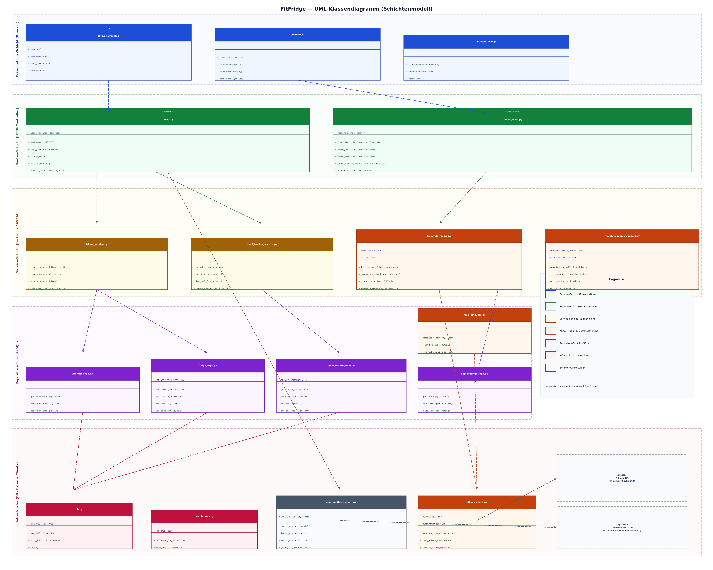
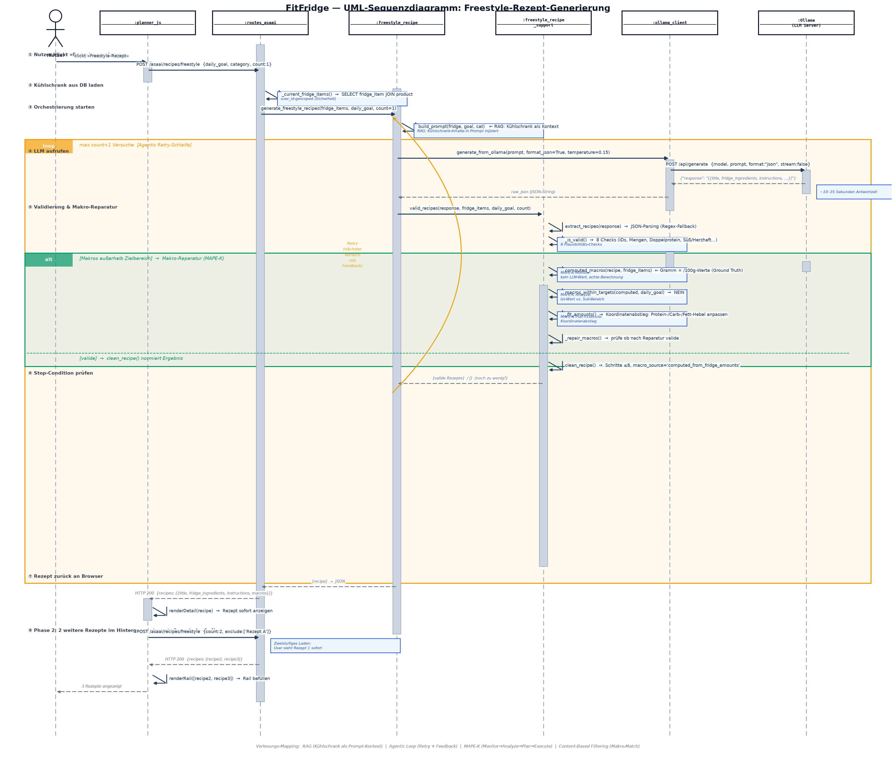

# FitFridge — Diagramm-Dokumentation

**Bezug:** `FitFridge_UML.png` · `FitFridge_Sequenz.png`  
**Stand:** 30.06.2026

---

## Inhaltsverzeichnis

1. [UML-Klassendiagramm — Schichtenmodell](#1-uml-klassendiagramm--schichtenmodell)
   - 1.1 [Aufbau und Lesekonvention](#11-aufbau-und-lesekonvention)
   - 1.2 [Schicht 1 – Präsentationsschicht (Browser)](#12-schicht-1--präsentationsschicht-browser)
   - 1.3 [Schicht 2 – Routenschicht (HTTP-Controller)](#13-schicht-2--routenschicht-http-controller)
   - 1.4 [Schicht 3 – Serviceschicht (Fachlogik & ASAAI)](#14-schicht-3--serviceschicht-fachlogik--asaai)
   - 1.5 [Schicht 4 – Repositoryschicht (SQL)](#15-schicht-4--repositoryschicht-sql)
   - 1.6 [Schicht 5 – Infrastrukturschicht (DB & Clients)](#16-schicht-5--infrastrukturschicht-db--clients)
   - 1.7 [Externe Systeme](#17-externe-systeme)
   - 1.8 [Abhängigkeits-Pfeile im Überblick](#18-abhängigkeits-pfeile-im-überblick)
2. [UML-Sequenzdiagramm — Freestyle-Rezept-Generierung](#2-uml-sequenzdiagramm--freestyle-rezept-generierung)
   - 2.1 [Teilnehmer und Lebenslinien](#21-teilnehmer-und-lebenslinien)
   - 2.2 [Phase ① — Nutzer-Aktion](#22-phase---nutzer-aktion)
   - 2.3 [Phase ② — Kühlschrank aus DB laden](#23-phase---kühlschrank-aus-db-laden)
   - 2.4 [Phase ③ — Orchestrierung starten (RAG)](#24-phase---orchestrierung-starten-rag)
   - 2.5 [loop-Rahmen — Agentic Retry-Schleife](#25-loop-rahmen--agentic-retry-schleife)
   - 2.6 [Phase ④ — LLM aufrufen](#26-phase---llm-aufrufen)
   - 2.7 [Phase ⑤ — Validierung & Makro-Reparatur](#27-phase---validierung--makro-reparatur)
   - 2.8 [alt-Rahmen — MAPE-K Makro-Reparatur](#28-alt-rahmen--mape-k-makro-reparatur)
   - 2.9 [Phase ⑥ — Stop-Condition](#29-phase---stop-condition)
   - 2.10 [Phase ⑦ — Rückgabe an den Browser](#210-phase---rückgabe-an-den-browser)
   - 2.11 [Phase ⑧ — Zweistufiges Laden (Phase 2)](#211-phase---zweistufiges-laden-phase-2)
3. [Zusammenhang beider Diagramme](#3-zusammenhang-beider-diagramme)
4. [Vorlesungs-Mapping (SE & ASAAI)](#4-vorlesungs-mapping-se--asaai)

---

## 1. UML-Klassendiagramm — Schichtenmodell



### 1.1 Aufbau und Lesekonvention

Das Klassendiagramm zeigt die **statische Struktur** von FitFridge als konsequent durchgezogenes **Schichtenmodell** (engl. *layered architecture*). Jede Schicht ist als farbiges Hintergrundband erkennbar; die Pfeile zwischen den Schichten zeigen die Richtung der Abhängigkeiten.

**UML-Notation in diesem Diagramm:**

| Symbol | Bedeutung |
|---|---|
| Rechteck mit 3 Sektionen | UML-Klasse / Modul (Name \| Attribute \| Methoden) |
| `+` vor Attribut/Methode | öffentlich (`public`) |
| `-` vor Attribut/Methode | privat (`private`) |
| `#` vor Attribut/Methode | geschützt (`protected`) |
| `«stereotype»` | UML-Stereotyp (z. B. `«Blueprint»`, `«view»`, `«system»`) |
| Gestrichelter Pfeil `- - -▶` | Abhängigkeit / `«uses»`-Beziehung |
| Gestrichelter Rahmen | Externer Dienst (außerhalb des eigenen Systems) |

**Leserichtung der Pfeile:** Ein Pfeil von Modul A nach Modul B bedeutet: *„A verwendet B"* (A hängt von B ab). Im Schichtenmodell zeigen alle Pfeile **nach unten** — höhere Schichten rufen tiefere auf, nie umgekehrt.

---

### 1.2 Schicht 1 – Präsentationsschicht (Browser)

**Farbe:** Blau | **Dateien:** `templates/`, `static/planner.js`, `static/barcode_scan.js`

Diese Schicht läuft vollständig im Browser des Nutzers. Sie ist die einzige Schicht, die der Nutzer direkt sieht und bedient.

#### `Jinja2 Templates` `«view»`

| Sektion | Inhalt |
|---|---|
| Attribute | `base.html`, `dashboard.html`, `meal_tracker.html`, `planner.html` |
| Methoden | — (Templates sind rein deklarativ, keine Logik) |

Die Templates werden serverseitig von Flask gerendert und enthalten HTML-Formulare für alle SE-Features (Kühlschrank, Tracker, Auth). `base.html` definiert das Seitenlayout mit Sidebar-Navigation. Template-Variablen (z. B. `{{ items }}`) werden von den Routen befüllt.

#### `planner.js`

| Sektion | Inhalt |
|---|---|
| Methoden | `loadFreestyleRecipe()`, `loadSavedRecipes()`, `saveCurrentRecipe()`, `renderDetail(recipe)` |

Steuert die ASAAI-Planner-Seite vollständig clientseitig per `fetch`-API. Kommuniziert **nicht** über HTML-Formulare, sondern schickt JSON an den ASAAI-Blueprint und empfängt JSON zurück. Implementiert das **zweistufige Laden** (Phase 1: ein Rezept sofort, Phase 2: zwei weitere im Hintergrund) und schützt via `requestToken` vor Race-Conditions bei schnellem Mehrfachklick.

#### `barcode_scan.js`

| Sektion | Inhalt |
|---|---|
| Methoden | `startBarcodeScan(onResult)`, `enhanceContrast(frame)`, `detectFrame()` |

Implementiert den Barcode-Scanner mit zwei Fallback-Ebenen:
1. **`BarcodeDetector` API** — nativer Browser-Standard (Android, macOS Safari/Chrome)
2. **`zxing-wasm`** — WebAssembly-Bibliothek als Fallback (Firefox, Windows, iOS)

`enhanceContrast()` verbessert Kameraframes vor der Erkennung durch Graustufen-Konvertierung und automatisches Level-Clipping (1%-Abschneiden extremer Helligkeitswerte gegen Überbelichtung). `detectFrame()` analysiert nur das mittlere Bildband, da 1D-Barcodes typischerweise horizontal ausgerichtet sind.

**Abhängigkeit:** `barcode_scan.js` → `routes.py` (sendet erkannten Barcode als Suchbegriff per Formular)

---

### 1.3 Schicht 2 – Routenschicht (HTTP-Controller)

**Farbe:** Grün | **Dateien:** `flaskr_new/routes.py`, `flaskr_new/asaai/routes_asaai.py`

Die Routenschicht ist die **HTTP-Schnittstelle** des Systems. Sie empfängt Requests, delegiert die Verarbeitung an die Serviceschicht und gibt Responses zurück. Sie enthält **keine Geschäftslogik** — nur HTTP-Parsing und Template-Rendering.

#### `routes.py` `«Blueprint: /»`

| Sektion | Inhalt |
|---|---|
| Attribute | `login_required` (Decorator): prüft Session vor jedem geschützten Request |
| Methoden | `dashboard()`, `meal_tracker()`, `fridge_add()`, `unified_search(q)`, `auth_login()`, `auth_logout()` |

Dieser Blueprint deckt alle **SE-Features** ab und rendert serverseitig HTML-Seiten (klassisches Request-Response-Modell). Die Methode `unified_search(q)` ist besonders: Sie kombiniert **drei Quellen** parallel — lokale DB (`search_by_name`), OpenFoodFacts-API und die KI-Nährwertschätzung (`estimate_food`) — und dedupliziert die Ergebnisse nach Barcode.

#### `routes_asaai.py` `«Blueprint: /asaai»`

| Sektion | Inhalt |
|---|---|
| Attribute | `require_user` (Decorator): gibt bei fehlendem Login **401 JSON** statt HTML-Redirect |
| Methoden | `freestyle()`, `saved_list()`, `saved_save()`, `saved_delete()`, `planner_ui()` |

Dieser Blueprint ist eine **JSON-API** und wird ausschließlich per `fetch` vom `planner.js` aufgerufen. Der Unterschied zu `routes.py`: Statt HTML-Redirect bei fehlendem Login antwortet dieser Blueprint mit `401 JSON` — das ist für AJAX-Clients korrekt, da ein HTML-Redirect im `fetch`-Kontext nicht sinnvoll verarbeitbar wäre. Rezepte werden als **JSON-Blob** in der Datenbank gespeichert (`saved_recipe.data`), der `title` als separate Spalte — so ist Umbenennen möglich, ohne den JSON-Blob zu parsen.

**Trennungsprinzip:** Beide Blueprints sind in der App-Factory (`__init__.py`) registriert und über URL-Präfixe getrennt (`/` und `/asaai`). Diese Trennung erlaubt es, SE- und ASAAI-Features unabhängig voneinander zu testen.

---

### 1.4 Schicht 3 – Serviceschicht (Fachlogik & ASAAI)

**Farbe:** Gelb (SE) / Orange (ASAAI) | **Dateien:** `fridge_service.py`, `meal_tracker_service.py`, `freestyle_recipe.py`, `freestyle_recipe_support.py`

Die Serviceschicht enthält die **gesamte Geschäftslogik**. Sie kennt weder das `request`-Objekt (Trennung von HTTP) noch schreibt sie direkt SQL (Trennung von Datenzugriff).

#### `fridge_service.py`

| Sektion | Inhalt |
|---|---|
| Methoden | `create_dashboard_item(q, uid)`, `create_from_data(data, uid)`, `update_dashboard_item(...)`, `calculate_total_nutrition(item)` |

Zentrale Logik für Kühlschrank-Operationen. `create_dashboard_item` löst einen Suchbegriff auf: zuerst lokale DB per Barcode, dann OpenFoodFacts, dann Produkt anlegen. Barcode-lose Produkte (z. B. KI-Schätzungen) werden unter ihrem **Namen als Barcode** gespeichert — so findet ein erneutes Hinzufügen denselben Eintrag wieder statt an einem `UNIQUE`-Constraint zu scheitern.

`calculate_total_nutrition(item)` delegiert an `calculations.py` und fügt einen `total_`-Präfix zu den Schlüsseln hinzu, damit die Dashboard-Summen eindeutig von den `/100g`-Werten unterscheidbar sind.

#### `meal_tracker_service.py`

| Sektion | Inhalt |
|---|---|
| Methoden | `normalize_macro_pct(p,c,f)`, `build_daily_summary(cfg, cons)`, `log_meal_from_product(...)`, `commit_meal_cart(uid, cart)` |

`normalize_macro_pct` stellt sicher, dass Protein + Carbs + Fett immer 100% ergibt — Rundungsdifferenzen landen auf dem Fett-Anteil. `commit_meal_cart` verarbeitet den Session-Warenkorb atomar: Fridge-Posten werden abgezogen, Reste aus Produktsuchen landen als neuer Kühlschrank-Eintrag.

#### `freestyle_recipe.py` `«ASAAI»`

| Sektion | Inhalt |
|---|---|
| Attribute | `MODEL_PROFILES` (Tokens/Zutaten je Modell), `_SCHEMA` (JSON-Zielstruktur) |
| Methoden | `build_prompt(fridge, goal, cat)`, `_macro_strategy_hint(fridge, goal)`, `_run(...)`, `generate_freestyle_recipes(...)` |

Das **Herzstück der ASAAI-Schicht**. `build_prompt` baut aus dem Kühlschrank-Inhalt, dem Tagesziel und der Rezeptart einen strukturierten Prompt für das LLM. `_macro_strategy_hint` analysiert die echten Nährwertdichten der verfügbaren Zutaten und gibt dem Modell konkrete Strategie-Hinweise (z. B. *„Hauptproteinquelle: 200–300g Hähnchenbrust (31g P/100g)"*, *„Low-Carb: Stärke reduzieren, Fett erhöhen"*). `_run` ist die Retry-Schleife (→ Sequenzdiagramm).

#### `freestyle_recipe_support.py` `«ASAAI»`

| Sektion | Inhalt |
|---|---|
| Attribute | `PROTEIN, STARCH, SWEET` (Keyword-Sets), `MACRO_TOLERANCES` (Toleranzwerte) |
| Methoden | `computed_macros()`, `_fit_amounts()`, `valid_recipes()`, `validation_feedback()` |

Die komplexeste Datei des Projekts (454 Zeilen). Enthält die **Knowledge Base** (domänenspezifische Keyword-Listen für Proteinquellen, Stärkequellen, Süßspeisen etc.) und die gesamte Validierungs- und Reparatur-Pipeline. `computed_macros()` ist der kritische Punkt: Nährwerte werden **ausschließlich aus Gramm-Mengen × /100g-Werten** der echten Produkte berechnet — LLM-eigene Nährwertschätzungen werden ignoriert. `_fit_amounts()` implementiert den Koordinatenabstieg zur Makro-Reparatur.

#### `food_estimate.py` `«ASAAI»`

| Sektion | Inhalt |
|---|---|
| Methoden | `estimate_food(query): dict` |

Schätzt Nährwerte für beliebige Lebensmittel via Ollama (JSON-Prompt) und gibt das Ergebnis im **exakt gleichen Format wie OpenFoodFacts** zurück. Dadurch erscheint die KI-Schätzung nahtlos als erster Treffer in `unified_search`. Bei jedem Fehler (LLM offline, ungültige Antwort) gibt die Funktion `None` zurück — sauberes Degradieren ohne Exception.

---

### 1.5 Schicht 4 – Repositoryschicht (SQL)

**Farbe:** Lila | **Dateien:** `product_repo.py`, `fridge_repo.py`, `meal_tracker_repo.py`, `app_settings_repo.py`

Die Repository-Schicht enthält **ausschließlich SQL** — kein `if`, keine Berechnungen, keine Geschäftslogik. Jede Funktion entspricht genau einer Datenbankoperation. Diese Reinheit ist der Grund, warum alle 39 Tests ohne laufenden Webserver funktionieren: Services und Repos sind unabhängig testbar.

#### `product_repo.py`

| Methode | Beschreibung |
|---|---|
| `get_by_barcode(bc)` | Einzelner Lookup per `UNIQUE`-Barcode |
| `create_product(...)` | INSERT, gibt `lastrowid` |
| `search_by_name(q)` | `LIKE`-Suche über `name` und `brand` |

#### `fridge_repo.py`

| Methode | Beschreibung |
|---|---|
| `list_items(user_id)` | JOIN `fridge_item × product`, neueste zuerst |
| `get_item(id, uid)` | **Sicherheitskritisch:** `WHERE id=? AND (user_id=? OR user_id IS NULL)` — verhindert Fremdzugriff |
| `add_item()` | INSERT neuer Posten |
| `update_amount()` | Mengen-Update, user-gescoped |

Die `user_id IS NULL`-Bedingung in `get_item` ist ein bewusster Entwurfsentscheid: Produkte ohne Besitzer (z. B. Seed-Daten) sind für alle lesbar, ohne dass ein Nutzer auf fremde Items zugreifen kann.

#### `meal_tracker_repo.py`

| Methode | Beschreibung |
|---|---|
| `get_settings(uid)` | Tagesziel-Einstellungen, Fallback auf `DEFAULT_SETTINGS` |
| `save_settings()` | **UPSERT** via `ON CONFLICT(user_id) DO UPDATE` |
| `add_meal_entry(...)` | Mahlzeit loggen |
| `get_day_totals(uid, date)` | `SUM`-Aggregat mit `COALESCE` (leere Tage → 0, nicht NULL) |

Das UPSERT-Muster (`ON CONFLICT ... DO UPDATE`) ersetzt das klassische „SELECT, dann INSERT oder UPDATE" durch eine einzige atomare Operation — ein SQLite-spezifisches Feature.

#### `app_settings_repo.py`

| Methode | Beschreibung |
|---|---|
| `get_settings(uid)` | Gewähltes LLM-Modell (Default: `qwen3.5:latest`) |
| `save_settings(uid, model)` | UPSERT auf `app_settings` |

---

### 1.6 Schicht 5 – Infrastrukturschicht (DB & Clients)

**Farbe:** Rot/Pink | **Dateien:** `db.py`, `calculations.py`, `ollama_client.py`, `openfoodfacts_client.py`

#### `db.py`

| Methode | Beschreibung |
|---|---|
| `get_db()` | Öffnet/cached eine `sqlite3`-Connection in Flask-`g`; `row_factory = sqlite3.Row` (Zugriff per Spaltenname) |
| `init_db()` | Führt `schema.sql` per `executescript` aus — bei jedem Serverstart ein kompletter DB-Reset |
| `close_db()` | Teardown, schließt die Connection am Ende jedes Requests |

Der bewusste DB-Reset bei jedem Start ist ein Uni-Setup-Entscheid: Jeder Demo-Lauf startet mit identischen Seed-Daten. In einem Produktions-System würde `init_db` durch Migrations-Skripte ersetzt.

#### `calculations.py`

| Methode | Beschreibung |
|---|---|
| `calculate_for_amount(p, amt, u)` | Rechnet Nährwerte für eine konkrete Menge aus. `stk` → über `grams_per_piece`; `g/ml/kg/cl/l` → über Einheiten-Faktoren |
| `safe_float(v, default)` | Toleranter Float-Parser: akzeptiert Komma als Dezimaltrennzeichen, fängt `None`/`""`/Fehler ab |

`safe_float` wird im gesamten Projekt als **Schutz an Eingabegrenzen** verwendet — überall dort, wo Nutzereingaben oder externe API-Werte in Zahlen umgewandelt werden müssen.

#### `ollama_client.py` `«ASAAI»`

| Attribut/Methode | Beschreibung |
|---|---|
| `DEFAULT_URL` | `http://127.0.0.1:11434` |
| `MODEL_CHOICES` | Drei wählbare Modelle: qwen3.5 (9B), qwen3 (4B), gemma3 (1B) |
| `generate_from_ollama(prompt)` | `POST /api/generate` mit `format:"json"`, `stream:false`, `think:false` |
| `test_ollama_model(model)` | Prüft ob Modell installiert ist und JSON-Modus funktioniert |
| `resolve_ollama_model(m)` | Priorität: expliziter Parameter → User-Einstellung aus DB → ENV-Variable → Default |

Die Modell-Auflösung in `resolve_ollama_model` ermöglicht flexible Konfiguration: Im Test kann ein Modell direkt übergeben werden, im Normalbetrieb gilt die gespeicherte User-Präferenz.

#### `openfoodfacts_client.py` `«ext»`

| Methode | Beschreibung |
|---|---|
| `search_product(barcode)` | `GET /api/v2/product/{barcode}.json` |
| `lookup_product(query)` | Barcode-String → `search_product`, sonst Textsuche + Ranking |
| `search_products(q, limit)` | Textsuche → für jeden Treffer Detail nachladen |
| `_rank_off_products(res, q)` | Relevanz-Scoring: exakt=60, enthält=35, Teilwort=15; Tiebreak nach Proteingehalt |

Verwendet ausschließlich `urllib` (Python-Stdlib) mit `certifi`-CA-Bundle für HTTPS. Keine externe Abhängigkeit wie `requests`. Netzwerkfehler werden abgefangen und geloggt — die Suche liefert dann eine leere Liste statt eines Absturzes.

---

### 1.7 Externe Systeme

Im Diagramm mit gestricheltem Rahmen und `«system»`-Stereotyp dargestellt — außerhalb des eigenen Systemeinflussbereichs:

| System | Schnittstelle | Verwendung |
|---|---|---|
| **Ollama API** `http://127.0.0.1:11434` | `POST /api/generate`, `GET /api/tags` | Rezeptgenerierung, KI-Nährwertschätzung, Modell-Test |
| **OpenFoodFacts API** | `GET /api/v2/product/`, `GET /cgi/search.pl` | Produkt-Lookup per Barcode, Textssuche |

Beide externen Systeme werden **ausschließlich über ihre jeweiligen Client-Module** angesprochen — kein direkter Zugriff aus Services oder Routen. Das isoliert externe Abhängigkeiten und macht sie im Test per `monkeypatch` austauschbar.

---

### 1.8 Abhängigkeits-Pfeile im Überblick

Die gestrichelten Pfeile folgen dem Schichtenmodell strikt **von oben nach unten**:

```
Browser        →   Routen           (HTML-Forms / fetch-JSON)
Routen         →   Services         (Methodenaufruf)
Services       →   Repositories     (DB-Lese-/Schreiboperationen)
Repositories   →   db.py            (Connection-Objekt)
Services       →   Externe Clients  (API-Aufrufe)
Externe Clients→   Externe Systeme  (HTTP)
```

Besondere Querverbindungen (nicht streng schichtparallel):
- `routes.py` → `openfoodfacts_client.py`: direkt via `unified_search`, da die Routen-Funktion drei Quellen zusammenführt
- `food_estimate.py` → `ollama_client.py`: KI-Nährwertschätzung sitzt konzeptuell zwischen Repository- und Serviceschicht

---

## 2. UML-Sequenzdiagramm — Freestyle-Rezept-Generierung



Das Sequenzdiagramm zeigt den **vollständigen zeitlichen Ablauf** der wichtigsten User-Story: *„Nutzer klickt auf Freestyle-Rezept generieren und erhält ein makro-genaues Rezept aus dem eigenen Kühlschrank."*

### 2.1 Teilnehmer und Lebenslinien

| Symbol | Teilnehmer | Rolle |
|---|---|---|
| Strichmännchen | `:Nutzer` | Akteur (außerhalb des Systems) |
| Rechteck | `:planner_js` | Browser-JavaScript, läuft clientseitig |
| Rechteck | `:routes_asaai` | Flask-Blueprint `/asaai`, serverseitig |
| Rechteck | `:freestyle_recipe` | Orchestrierungs-Modul |
| Rechteck | `:freestyle_recipe_support` | Validierung, Makros, Reparatur |
| Rechteck | `:ollama_client` | HTTP-Client zu Ollama |
| Rechteck | `:Ollama` | Externes LLM-System |

**Lebenslinien** (gestrichelte Vertikalen): Jeder Teilnehmer existiert für die gesamte Dauer des Szenarios im Speicher.

**Aktivitätsbalken** (grau gefüllte Rechtecke): Zeigen an, wann ein Teilnehmer aktiv Code ausführt oder auf eine Antwort wartet.

**Nachrichten:**
- **Durchgezogener Pfeil** `——▶` = synchroner Aufruf (Aufrufer wartet auf Rückantwort)
- **Gestrichelter Pfeil** `- - -▶` = Rückantwort (optional in UML, hier zur Klarheit eingezeichnet)
- **Selbst-Pfeil** = interne Operation desselben Objekts

---

### 2.2 Phase ① — Nutzer-Aktion

```
:Nutzer  ——▶  :planner_js   klickt »Freestyle-Rezept«
:planner_js  ——▶  :routes_asaai   POST /asaai/recipes/freestyle {daily_goal, category, count:1}
```

Der Nutzer klickt den Button auf der Planner-Seite. `planner.js` liest die eingegebenen Zielwerte aus den Input-Feldern (`buildDailyGoal()`) und schickt einen `fetch`-POST-Request an den ASAAI-Blueprint. Das `count:1` signalisiert: Phase 1 — nur ein Rezept, so schnell wie möglich.

---

### 2.3 Phase ② — Kühlschrank aus DB laden

```
:routes_asaai  →  :routes_asaai   _current_fridge_items()
                                   SELECT fridge_item JOIN product WHERE user_id=?
```

Bevor das LLM aufgerufen wird, liest `routes_asaai` den **aktuellen Kühlschrank-Inhalt** aus der SQLite-Datenbank. Der Selbstaufruf `_current_fridge_items()` führt intern einen JOIN über `fridge_item` und `product` aus, gescoped auf die `user_id` des eingeloggten Nutzers. Das Ergebnis ist eine Liste von Dictionaries mit allen Produkt-Nährwerten.

**Sicherheitsprinzip:** Durch die `user_id`-Bedingung kann kein Nutzer den Kühlschrank eines anderen Nutzers als Kontext einschleusen.

---

### 2.4 Phase ③ — Orchestrierung starten (RAG)

```
:routes_asaai  ——▶  :freestyle_recipe   generate_freestyle_recipes(fridge_items, daily_goal, count=1)
:freestyle_recipe  →  :freestyle_recipe   build_prompt(fridge, goal, cat)
```

`routes_asaai` übergibt die Kühlschrank-Daten und das Tagesziel an `freestyle_recipe.py`. Dort baut `build_prompt()` einen strukturierten deutschen Prompt.

**Verbindung zur Vorlesung — RAG (Retrieval-Augmented Generation):**

Der Kühlschrank-Inhalt wird als **externer Kontext in den Prompt injiziert**:

```
Verfügbare Kühlschrank-Zutaten:
1. Hähnchenbrust (id=3): 300g | 165 kcal, 31g P, 0g C, 4g F je 100g
2. Reis, weiß (id=7): 500g | 130 kcal, 2g P, 28g C, 0g F je 100g
...
```

Das LLM kennt diesen Bestand nicht aus seinem Training — er wird zur Laufzeit **abgerufen (Retrieval)**, **in den Prompt eingefügt (Augmentation)** und dann ein Rezept **generiert (Generation)**. Das ist RAG in Reinform.

---

### 2.5 loop-Rahmen — Agentic Retry-Schleife

Der gelbe `loop`-Rahmen umschließt die Schritte ④ bis ⑥. Er läuft maximal `count + 1` Mal.

**Verbindung zur Vorlesung — Agentic Systems:**

Das klassische Agentic-Muster `Prompt → Validate → Feedback → Retry` ist hier vollständig implementiert:

1. **Prompt** → LLM aufrufen
2. **Validate** → Ergebnis prüfen (`valid_recipes`)
3. **Feedback** → Fehlerbeschreibung formulieren (`validation_feedback`)
4. **Retry** → neuer Prompt mit Feedback und Ausschluss bereits gesehener Titel

Der Retry-Pfeil im Diagramm zeigt die Rückschleife von der Stop-Condition zurück zum LLM-Aufruf.

---

### 2.6 Phase ④ — LLM aufrufen

```
:freestyle_recipe  ——▶  :ollama_client   generate_from_ollama(prompt, format_json=True, temperature=0.15)
:ollama_client     ——▶  :Ollama          POST /api/generate {model, prompt, format:"json", stream:false}
:Ollama            - - ▶ :ollama_client  {"response": "[{title, fridge_ingredients, instructions, …}]"}
:ollama_client     - - ▶ :freestyle_recipe  raw_json
```

`ollama_client.py` schickt einen HTTP-POST an den lokal laufenden Ollama-Server. Kritische Parameter:
- `format: "json"` — Ollama erzwingt JSON-Output (JSON-Mode)
- `stream: false` — Vollständige Antwort auf einmal statt Stream
- `think: false` — Unterdrückt Chain-of-Thought-Ausgabe bei Reasoning-Modellen
- `temperature: 0.15` — niedrig beim ersten Rezept (deterministisch), `0.7` bei Folge-Rezepten (Variabilität)

Die Antwortzeit beträgt je nach Modell und Hardware **10–35 Sekunden** — der längste Schritt im Ablauf. Deshalb das zweistufige Laden (→ Phase ⑧).

---

### 2.7 Phase ⑤ — Validierung & Makro-Reparatur

```
:freestyle_recipe  ——▶  :freestyle_recipe_support   valid_recipes(response, fridge_items, daily_goal)
:freestyle_recipe_support  →  (intern)   extract_recipes(response)
:freestyle_recipe_support  →  (intern)   _is_valid()  →  8 Checks
```

`freestyle_recipe_support.py` empfängt die rohe LLM-Antwort und verarbeitet sie in einer mehrstufigen Pipeline:

**Schritt 1 — Parsing:**  
`extract_recipes(response)` parst das JSON. Falls das Modell das JSON in Markdown-Code-Blöcke eingebettet hat oder ein einzelnes Objekt statt Array liefert, greift ein Regex-Fallback.

**Schritt 2 — 8 Plausibilitäts-Checks (`_is_valid`):**

| # | Prüfung | Beispiel-Ablehnung |
|---|---|---|
| 1 | Nur echte Kühlschrank-IDs | LLM erfindet `id=99`, das nicht existiert |
| 2 | Realistische Portionsgrößen (0 < g ≤ 1200) | 5000g Hähnchen |
| 3 | Supplements ≤ 80g | 500g Whey-Protein |
| 4 | Pantry-Limits (Öl ≤ 50g, Salz ≤ 10g) | 200g Öl |
| 5 | Keine doppelte Proteinquelle | Hähnchen + Thunfisch gleichzeitig |
| 6 | Keine doppelte Stärkequelle | Reis + Nudeln gleichzeitig |
| 7 | Kein Süß-Herzhaft-Mix | Honig + Hähnchenbrust |
| 8 | Titel-Zutaten-Konsistenz | „Lachs-Bowl" ohne Lachs |
| + | Mindestens 3 Kochschritte | Ein-Schritt-Rezepte |
| + | Makros im Zielbereich (nach Reparatur) | Makros weit außerhalb Toleranz |

---

### 2.8 alt-Rahmen — MAPE-K Makro-Reparatur

Der grüne `alt`-Rahmen zeigt den Alternativpfad, der nur aktiv wird wenn die berechneten Makros **außerhalb des Zielbereichs** liegen.

**Verbindung zur Vorlesung — MAPE-K (Adaptive Systems):**

```
Monitor   →  computed_macros()       Ist-Makros aus Gramm × /100g berechnen
Analyze   →  macros_within_targets()  Soll-Ist-Vergleich gegen Toleranzbereich
Plan      →  _fit_amounts()           Koordinatenabstieg: Hebel-Zutat identifizieren
Execute   →  _set_fridge_amounts()    Gramm-Mengen anpassen
Knowledge →  PROTEIN, STARCH, SWEET   Domänenwissen über Nährstoffdichte
```

**Monitor — `computed_macros()`:**  
Berechnet kcal, Protein, Fett und Kohlenhydrate **ausschließlich** aus den Gramm-Mengen der Rezeptzutaten multipliziert mit den `/100g`-Werten der echten Produkte aus der Datenbank. LLM-eigene `estimated_macros` werden vollständig ignoriert — sie könnten halluziniert sein.

```python
# Prinzip:
for ingredient in recipe["fridge_ingredients"]:
    product = fridge_items[ingredient["id"]]
    factor  = ingredient["amount_g"] / 100
    kcal   += product["kcal_per_100g"]    * factor
    protein += product["protein_per_100g"] * factor
```

**Analyze — `macros_within_targets()`:**  
Vergleicht jeden berechneten Makro gegen einen Toleranzbereich:
- kcal: max +10% über Ziel
- Protein: nur Untergrenze (mehr Protein ist akzeptabel)
- Fett/Carbs: symmetrische Toleranz mit absoluten Mindest-Floors

**Plan & Execute — `_fit_amounts()` (Koordinatenabstieg):**  
Wählt pro Makro **eine Hebel-Zutat** — die Zutat mit der höchsten Nährstoffdichte für den jeweiligen Makro:

```
Protein-Hebel  →  max(zutaten, key=protein_per_100g)   z. B. Hähnchenbrust (31g/100g)
Carb-Hebel     →  max(zutaten, key=carbs_per_100g)     z. B. Reis (28g/100g)
Fett-Hebel     →  max(zutaten, key=fat_per_100g)       z. B. Olivenöl (100g/100g)
```

Für jede Hebel-Zutat wird die benötigte Grammzahl algebraisch berechnet:

```
protein_needed_g = (target_protein_g - protein_from_others) / (lever_protein / 100)
```

Das Ergebnis wird auf valide Grenzen geklemmt (0–1200g, Supplements ≤ 80g). Falls der Koordinatenabstieg nicht ausreicht, skaliert ein Fallback die gesamte Portion proportional auf das kcal-Ziel.

**Warum Koordinatenabstieg statt einfachem Skalieren?**  
Einfaches Skalieren (alle Mengen × Faktor) behebt proportionale Fehler, aber keine strukturellen. Beispiel: Das Modell generiert 400g Reis + 100g Hähnchen für ein Ziel von 60g Protein. Hähnchen liefert nur 31g P/100g, also müssten 194g Hähnchen verwendet werden. Skalieren würde auch den Reis proportional erhöhen, was das Carb-Ziel verletzt. Der Koordinatenabstieg löst genau dieses Problem: Er passt **selektiv** den Protein-Hebel hoch und den Stärke-Hebel runter.

---

### 2.9 Phase ⑥ — Stop-Condition

```
:freestyle_recipe_support  - - ▶  :freestyle_recipe   [valide Rezepte] / []
```

`valid_recipes()` gibt die Sammlung der bisher validierten Rezepte zurück. In `_run()` wird geprüft:
- `len(recipes) >= count` → **Schleife beendet** (Stop-Condition erfüllt)
- `len(recipes) < count` → **Retry**: `validation_feedback()` formuliert konkretes Feedback (z. B. *„Doppelte Proteinquelle: Hähnchen + Thunfisch. Bitte nur eine verwenden."*), bereits gesehene Titel werden zu `exclude` hinzugefügt, und ein neuer Prompt wird gebaut.

---

### 2.10 Phase ⑦ — Rückgabe an den Browser

```
:freestyle_recipe  - - ▶  :routes_asaai   [recipe]
:routes_asaai      - - ▶  :planner_js     HTTP 200 {recipes: [...]}
:planner_js  →  :planner_js               renderDetail(recipe)
```

Das validierte und reparierte Rezept wird als JSON-Response an `planner.js` zurückgegeben. `renderDetail()` baut die Detailansicht im Browser auf: Titel, Zutatenliste mit Gramm-Mengen, Kochschritte und die berechneten Makros (`macro_source: "computed_from_fridge_amounts"` zeigt dem Nutzer, dass die Werte real berechnet wurden).

---

### 2.11 Phase ⑧ — Zweistufiges Laden (Phase 2)

```
:planner_js  ——▶  :routes_asaai   POST /asaai/recipes/freestyle {count:2, exclude:["Rezept A"]}
...
:routes_asaai  - - ▶  :planner_js  HTTP 200 {recipes: [recipe2, recipe3]}
:planner_js  →  :planner_js        renderRail([recipe2, recipe3])
```

**Das zweistufige Laden ist die UX-Antwort auf die LLM-Latenz:**

- **Phase 1** (im Sequenzdiagramm: Phasen ①–⑦): `count:1`, sobald ein Rezept valide ist, wird es sofort angezeigt. Wartezeit: ~10–35 Sekunden.
- **Phase 2** (Phase ⑧): `count:2`, `exclude:[Titel aus Phase 1]`. Läuft im Hintergrund, während der Nutzer bereits Rezept 1 liest. Ergebnis wird in die Rail neben Rezept 1 eingeblendet.

`requestToken` in `planner.js` verhindert, dass ein schneller Doppelklick zu zwei gleichzeitig laufenden Anfrage-Paaren führt (Race-Condition).

**Ergebnis:** Der Nutzer sieht **sofort** etwas (statt 90 Sekunden auf alle drei Rezepte zu warten) und hat nach weiteren ~30 Sekunden alle drei Vorschläge verfügbar.

---

## 3. Zusammenhang beider Diagramme

Das **Klassendiagramm** zeigt *was* existiert (statische Struktur, Module, Attribute, Methoden, Schichten).  
Das **Sequenzdiagramm** zeigt *wie* es zur Laufzeit zusammenarbeitet (dynamischer Ablauf, Nachrichten, Timing).

Aus dem Sequenzdiagramm ableitbar (nach HAW-Vorlesung, Folie 25):
> *„Der Pfeil im Sequenzdiagramm zeigt zu einem Objekt der Klasse, zu der die Operation gehört."*

| Pfeil im Sequenzdiagramm | Zugehörige Klasse im Klassendiagramm |
|---|---|
| `generate_freestyle_recipes(...)` → `:freestyle_recipe` | `freestyle_recipe.py` → Methode `generate_freestyle_recipes()` |
| `valid_recipes(...)` → `:freestyle_recipe_support` | `freestyle_recipe_support.py` → Methode `valid_recipes()` |
| `generate_from_ollama(...)` → `:ollama_client` | `ollama_client.py` → Methode `generate_from_ollama()` |

Beide Diagramme verlinken aufeinander, aber **ergänzen sich**, statt sich zu duplizieren — gemäß UML-Konvention: *„Sequenz- und Klassendiagramme können und sollten einander verlinken — aber nicht direkt zusammengeführt werden."*

---

## 4. Vorlesungs-Mapping (SE & ASAAI)

| Vorlesungskonzept | Umsetzung in FitFridge | Diagramm-Stelle |
|---|---|---|
| **Schichtenmodell (SE)** | 5 strikt getrennte Schichten, Abhängigkeiten nur nach unten | Klassendiagramm: alle Schichten |
| **Repository-Pattern (SE)** | `*_repo.py` = reines SQL, kein Businesscode | Klassendiagramm: Schicht 4 |
| **Blueprint-Pattern (SE)** | `routes.py` (SE) + `routes_asaai.py` (ASAAI) | Klassendiagramm: Schicht 2 |
| **LLMs / In-Context Learning** | JSON-Prompt-Modus, KI-Nährwertschätzung | Klassendiagramm: `ollama_client.py` |
| **RAG** | Kühlschrank-Inhalt als Prompt-Kontext | Sequenzdiagramm: Phase ③ |
| **Agentic Systems** | Retry-Loop mit Validierungs-Feedback | Sequenzdiagramm: `loop`-Rahmen |
| **Recommender Systems** | Content-Based Filtering via `_macro_strategy_hint` | Klassendiagramm: `freestyle_recipe.py` |
| **MAPE-K (Adaptive Systems)** | Koordinatenabstieg zur Makro-Reparatur | Sequenzdiagramm: `alt`-Rahmen |
| **Kontextbasierte Adaptivität** | Prompt variiert je nach Kühlschrank, Ziel, Kategorie | Sequenzdiagramm: Phase ③ |
| **Systemzentrische Adaptivität** | Selbst-heilende Retry-Schleife ohne Nutzereingriff | Sequenzdiagramm: `loop`-Rahmen |
| **Nutzerbasierte Adaptivität** | Makro-Reparatur auf individuelles Tagesziel | Sequenzdiagramm: `alt`-Rahmen |
